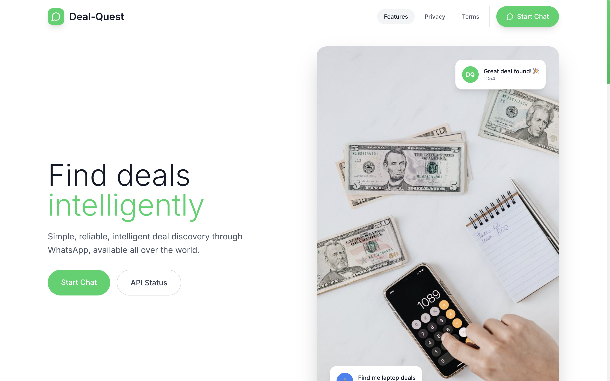
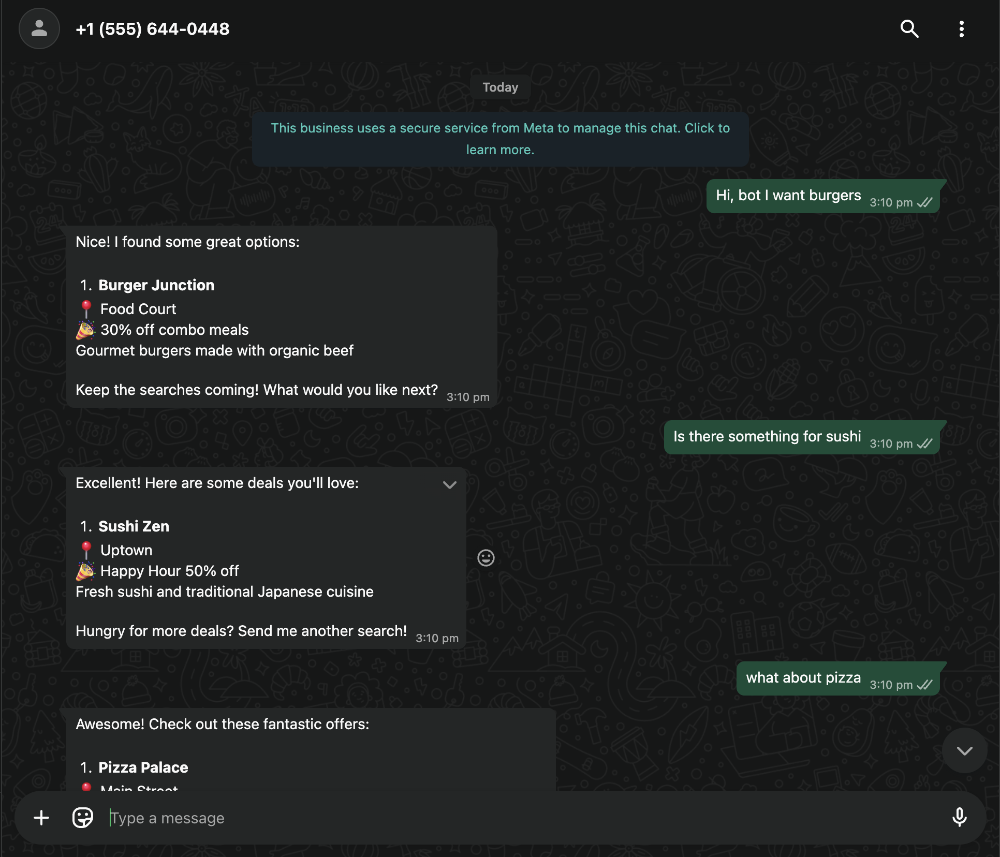
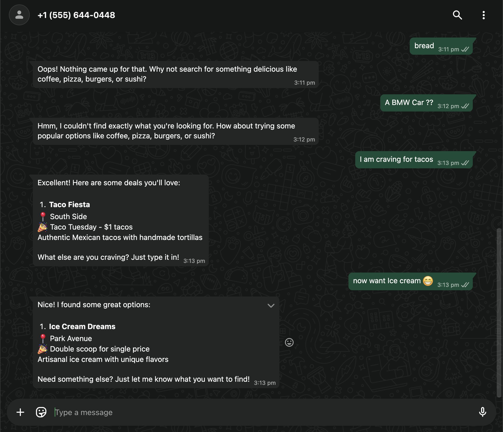
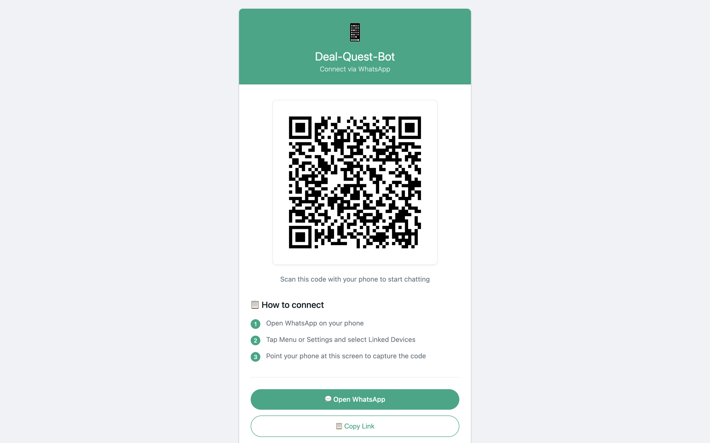
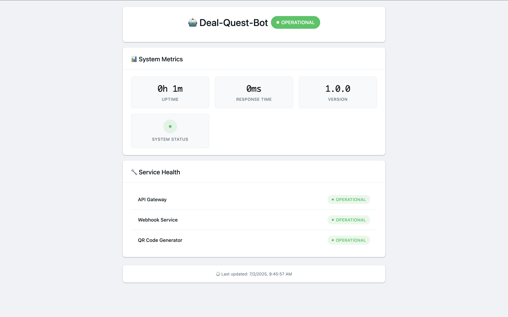
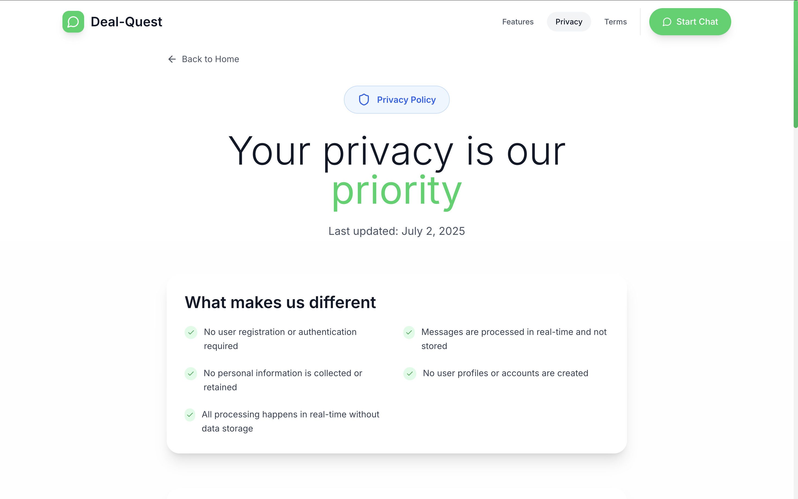
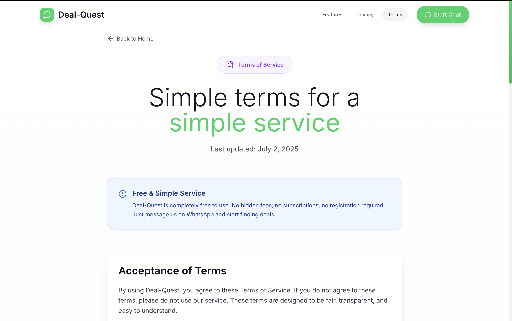

# Deal Quest Bot

A production-ready WhatsApp business bot that demonstrates intelligent deal discovery capabilities. Built with Node.js and TypeScript, deployed as serverless functions on Vercel for optimal scalability and performance.

## Live Demo

**[Try Deal Quest Bot Live](https://deal-quest-app.vercel.app/)**

Access the interactive QR code, system status, and start chatting with the bot instantly!



## Overview

Deal Quest Bot enables users to discover relevant deals and offers through natural language queries via WhatsApp. The system processes free-form text input and returns curated results from a comprehensive deal catalog, showcasing modern chatbot architecture and API integration patterns.

## Demo Screenshots

### Bot Interaction

<div align="center">
  
  
</div>

### QR Code Generation



### System Health Monitoring



### Privacy & Terms Pages

<div align="center">
  
  
</div>

## Key Features

**WhatsApp Integration**: Seamless communication through Meta's WhatsApp Cloud API with webhook-based message handling

**Intelligent Search**: Natural language processing for deal discovery with fuzzy matching capabilities

**Interactive QR Code**: Dynamic QR code generation for instant bot access and user onboarding

**Health Monitoring**: Built-in status monitoring with detailed system health reporting

**Serverless Architecture**: Optimized for Vercel's serverless platform with automatic scaling

**Webhook Security**: Secure webhook verification with token-based authentication

## Architecture

```
deal-quest-bot/
├── api/
│   ├── catalog.json           # Deal catalog data store
│   ├── health-template.html   # Health check UI template
│   ├── qr-template.html       # QR code display template
│   ├── qr.ts                  # QR code generation endpoint
│   ├── status.ts              # System health monitoring
│   └── webhook.ts             # WhatsApp webhook handler
├── media-content/
│   └── demo-screenshots/      # Project demo images
│       ├── API-QR.png
│       ├── API-Status.png
│       ├── Bot-Demo-01.png
│       ├── Bot-Demo-02.png
│       ├── Web-Hero.png
│       ├── Web-Privacy.png
│       └── Web-Terms.png
├── package.json
├── tsconfig.json
├── vercel.json
└── README.md
```

## Prerequisites

- Node.js 16+ with npm or Yarn
- Vercel CLI for deployment (`npm install -g vercel`)
- Meta WhatsApp Business API access
- TypeScript development environment
- Facebook Developer Account

## Environment Configuration

Configure the following environment variables in your `.env` file for local development and in Vercel's dashboard for production:

| Variable               | Description                                | Example                 | Required |
| ---------------------- | ------------------------------------------ | ----------------------- | -------- |
| `WHATSAPP_TOKEN`       | Meta WhatsApp Cloud API Bearer token       | `EAABs...`              | Yes      |
| `WHATSAPP_PHONE_ID`    | WhatsApp Business phone number ID          | `123456789012345`       | Yes      |
| `WHATSAPP_NUMBER`      | Business WhatsApp number for QR generation | `whatsapp:+1234567890`  | Yes      |
| `WEBHOOK_VERIFY_TOKEN` | Custom token for webhook verification      | `your-secure-token-123` | Yes      |

## Complete Meta WhatsApp Business API Setup

### Step 1: Create Facebook Developer Account

1. Visit [Facebook Developers](https://developers.facebook.com/)
2. Click "Get Started" and create a developer account
3. Verify your account with phone number and email
4. Complete the developer onboarding process

### Step 2: Create a New App

1. Go to [My Apps](https://developers.facebook.com/apps/)
2. Click "Create App"
3. Select "Business" as the app type
4. Provide app details:
    - **App Name**: `Deal Quest Bot` (or your preferred name)
    - **App Contact Email**: Your email address
    - **Business Account**: Select or create a business account
5. Click "Create App"

### Step 3: Add WhatsApp Product

1. In your app dashboard, find "WhatsApp" in the products list
2. Click "Set up" next to WhatsApp
3. Select "WhatsApp Cloud API" (not On-Premises)
4. Choose your business account or create a new one

### Step 4: Configure WhatsApp Settings

1. **Get Phone Number ID**:
    - Go to WhatsApp > Getting Started
    - Copy the "Phone number ID" (this is your `WHATSAPP_PHONE_ID`)
    - Note the test phone number provided

2. **Generate Access Token**:
    - In the same section, click "Generate Access Token"
    - Copy the token (this is your `WHATSAPP_TOKEN`)
    - **Important**: This is a temporary token for development

3. **Add Recipient Phone Number**:
    - Click "Add recipient phone number"
    - Enter your personal WhatsApp number for testing
    - Verify the number via WhatsApp

### Step 5: Set Up Webhook

1. **Deploy Your App First**:

    ```bash
    # Deploy to get your webhook URL
    vercel --prod
    ```

2. **Configure Webhook in Meta**:
    - Go to WhatsApp > Configuration
    - Click "Edit" next to Webhook
    - **Callback URL**: `https://your-app.vercel.app/api/webhook`
    - **Verify Token**: Enter your `WEBHOOK_VERIFY_TOKEN` value
    - Click "Verify and Save"

3. **Subscribe to Webhook Fields**:
    - Check "messages" to receive message notifications
    - Save the configuration

### Step 6: Test Your Setup

1. **Send Test Message**:
    - Use the test number provided in Getting Started
    - Send a message from your verified phone number
    - Check your app logs for incoming webhook calls

2. **Verify Bot Responses**:
    - Try queries like "pizza deals" or "electronics"
    - Confirm the bot responds with relevant deals

### Step 7: Production Setup (Optional)

For production deployment beyond the development phase:

1. **Business Verification**:
    - Complete Meta Business Verification
    - Provide business documents and information

2. **App Review**:
    - Submit your app for Meta's review process
    - Provide app description and use case documentation

3. **Permanent Access Token**:
    - Generate a permanent access token
    - Update your environment variables

4. **Phone Number**:
    - Add your own business phone number
    - Complete phone number verification

## API Documentation

### Health Check Endpoint

```
GET /api/status
```

Returns comprehensive system health information including uptime, configuration status, and service availability.

**Response**: HTML dashboard with system metrics

### QR Code Generator

```
GET /api/qr
```

Generates an interactive QR code that opens WhatsApp with a pre-configured message to initiate bot interaction.

**Response**: HTML page with embedded SVG QR code

### WhatsApp Webhook

```
POST /api/webhook
```

Processes incoming WhatsApp messages and responds with relevant deal information.

**Request Body**: Meta WhatsApp webhook payload
**Processing Logic**:

1. Verify webhook signature and token
2. Extract and validate message content
3. Execute fuzzy search against deal catalog
4. Format and return top matching results
5. Handle error cases and fallback responses

## Deal Discovery Algorithm

The bot implements an intelligent search mechanism that:

```typescript
function findDeals(query: string) {
    const searchTerm = query.toLowerCase().trim();
    return catalog
        .filter(
            (item) =>
                item.name.toLowerCase().includes(searchTerm) ||
                item.category.toLowerCase().includes(searchTerm) ||
                item.description.toLowerCase().includes(searchTerm),
        )
        .sort(
            (a, b) =>
                calculateRelevanceScore(b, searchTerm) -
                calculateRelevanceScore(a, searchTerm),
        )
        .slice(0, 5);
}
```

## Development Workflow

### Local Development

```bash
# Clone the repository
git clone https://github.com/yourusername/deal-quest-bot.git
cd deal-quest-bot

# Install dependencies
npm install

# Create environment file
cp .env.example .env
# Edit .env with your configuration

# Compile TypeScript
npm run build

# Start development server
vercel dev

# Test endpoints
curl http://localhost:3000/api/status
curl http://localhost:3000/api/qr
```

### Testing

```bash
# Test webhook verification
curl -X GET "http://localhost:3000/api/webhook?hub.mode=subscribe&hub.challenge=test&hub.verify_token=your-token"

# Test webhook with sample payload
curl -X POST http://localhost:3000/api/webhook \
  -H "Content-Type: application/json" \
  -d @test-payload.json
```

## Deployment

### Vercel Deployment

```bash
# Install Vercel CLI
npm install -g vercel

# Initial setup
vercel login
vercel

# Set environment variables
vercel env add WHATSAPP_TOKEN
vercel env add WHATSAPP_PHONE_ID
vercel env add WHATSAPP_NUMBER
vercel env add WEBHOOK_VERIFY_TOKEN

# Production deployment
vercel --prod
```

### Post-Deployment Configuration

1. **Webhook URL**: Update WhatsApp API configuration with production URL
2. **Domain Verification**: Ensure proper SSL and domain configuration
3. **Monitoring**: Set up alerts for webhook failures and API rate limits
4. **Testing**: Verify all endpoints work correctly in production

## Production Considerations

**Security**:

- Implement webhook signature verification
- Use strong verify tokens
- Enable rate limiting
- Validate all incoming data

**Scalability**:

- Leverage Vercel's automatic scaling
- Implement proper error handling
- Use caching for frequently accessed data

**Monitoring**:

- Set up comprehensive logging
- Implement error tracking
- Monitor API rate limits
- Track user engagement metrics

**Performance**:

- Optimize catalog search algorithms
- Implement response caching
- Minimize cold start times

**Compliance**:

- Ensure WhatsApp Business API policy compliance
- Implement data privacy measures
- Handle user consent properly

## Technical Specifications

- **Runtime**: Node.js 18.x
- **Language**: TypeScript 5.x
- **Platform**: Vercel Serverless Functions
- **API Integration**: Meta WhatsApp Cloud API v18.0
- **Dependencies**: Minimal footprint with essential packages only
- **Response Time**: Sub-200ms for deal searches
- **Uptime**: 99.9% availability target

## Troubleshooting

### Common Issues

1. **Webhook Verification Failed**:
    - Check `WEBHOOK_VERIFY_TOKEN` matches Meta configuration
    - Ensure webhook URL is accessible and returns 200 status

2. **Messages Not Received**:
    - Verify phone number is added to recipients
    - Check webhook subscription fields include "messages"
    - Confirm app is not in restricted mode

3. **Bot Not Responding**:
    - Check WhatsApp token validity
    - Verify phone number ID configuration
    - Review application logs for errors

4. **API Rate Limits**:
    - Implement exponential backoff
    - Monitor API usage in Meta dashboard
    - Consider upgrading to business account

## Contributing

This project demonstrates best practices for:

- Serverless API development
- WhatsApp Business integration
- TypeScript application architecture
- Production deployment workflows

## License

This project is licensed under the MIT License - see the [LICENSE](LICENSE) file for details.

## Connect with the Developer

- **Portfolio**: [singhtwenty2.pages.dev](https://singhtwenty2.pages.dev/)
- **Twitter/X**: [@singhtwenty2](https://x.com/singhtwenty2)

## Acknowledgments

- Built with assistance from modern AI development tools including Claude AI and ChatGPT
- Meta WhatsApp Cloud API Documentation
- Vercel Serverless Functions Documentation
- TypeScript Official Documentation

---

**Professional Implementation**: This project showcases production-ready chatbot development with enterprise-grade architecture and deployment practices. Perfect for developers looking to integrate WhatsApp Business API into their applications.
